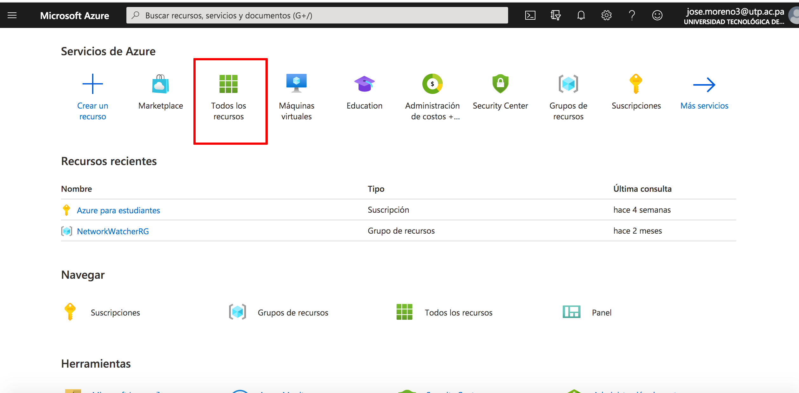

# CI/CD Pipeline de Wordpress en Azure

Wordpress es uno de los CMS más utilizado a nivel mundial cuenta con 37% del mercado de todos los sitios web en el mundo según [Kinsta](https://kinsta.com/wordpress-market-share/ "Wordpress Market Share"), uno de los mayores exponentes encontramos el sitio de [whitehouse.gov](https://www.whitehouse.gov/ "whitehouse.gov"). Esta herramienta no se puede dejar pasar y más en la situación actual que acelero la transformación digital de muchas empresas facilitando el comercio electrónico con plugins como [https://woocommerce.com](https://woocommerce.com/ "woocommerce") y su integración con diversas pasarelas de pagos.  Existen numerosas maneras de hacer una implementación para wordpress instalación oneclick de diferentes paneles compartidos, self-hosted (auto administrado) en una [vps](https://www.vultr.com/?ref=8403796-6G "vultr.com"), utilizando docker o kubernetes.

Por ello y a manera de investigación educativa un grupo de colegas que hemos formado un PurpleTeam (iniciando), nos dimos la tarea de buscar una manera de hacer un deployment a producción que cumpla con todos los pasos necesarios de un Pipeline utilizando wordpress e implementado en Azure.

La integración continua y la entrega/implementación continua (a menudo denominada CI/CD) son los pilares de DevOps y cualquier práctica moderna de desarrollo de software. Por ello ahora compartiremos una pequeña guía para la implementación de un pipeline.


##### Requerimientos

1. Cuenta Educativa en [Azure.com](https://azure.microsoft.com/en-us/services/devops/?nav=min "Educativa")
2. Un buen café para acompañarnos en la implementación


##### 1. Creación del Proyecto

Debemos descargar el core del código de wordpress y añadirlo a un repositorio en una cuenta de GitHub dado que deseamos hacerle un build con el pipeline de azure. En mi caso utilizara mi [Repositorio](https://github.com/jam620/wordpress-trunk "Github") 


​	Procedemos a crear nuestro proyecto con nuestra cuenta como desarrollador en [Azure.com](https://azure.microsoft.com/en-us/services/devops/?nav=min" Educativa)


Una vez nos aparece nuestro workspace vamos a la sección de Repos


Una vez en la sección vamos a importa el proyecto de wordpress que creamos con la versión trunk


La siguiente imagen vamos a colocar el url del repositorio 


 Observamos los siguiente mientras se importa el proyecto


Una vez importado nos aparece de la siguiente forma


##### 2. Creación de la webapp

Necesitaremos una cuenta educativa en [Azure.com](https://azure.microsoft.com/en-us/pricing/member-offers/credit-for-visual-studio-subscribers/ "Educativa") y vamos a todos los recursos



Creamos una webapp para ello vamos a la opción agregar y luego escribimos **webapp**


Damos click en **Crear**


Procedemos a llenar los datos solicitados y procedemos a darle a siguiente


La revisión permitirá corregir de ser necesario la región


Vamos a crear nuestra aplicación si tenemos todo bien


Mientras se va creando podremos observar lo siguiente 


##### 3. Creación de Base de datos

Recordemos que estamos creando una aplicación web en este caso un wordpress por lo que necesitaremos ahora una base de dato.

Vamos ahora agregar un recurso llamado Azure Database for MySQL


Seleccionamos Nuestra configuración para el servidor de base de datos, con los datos mostrados a continuación, prestar atención en la configuración del servidor


Rellenamos los campos de credenciales solicitados y licuamos **Revisar y crear**


Comprobamos que este correcto y vamos a crear


Cuando este listo podremos observar el recurso creado en 


Por temas del laboratorio vamos a deshabilitar un parámetro de seguridad y guardamos


Añadimos la dirección ip de nuestro cliente


**Nota:** La siguiente regla es para pruebas y no es recomendada, una vez que este en producción solo e deben permitir el acceso a los servidores de nuestra red.


Para terminar la conexión de la base de datos a la aplicación con este pipeline necesitamos establecer la conexión para ello nos dirigimos a cadenas de conexión y copias la cadena donde reemplazaremos los datos más adelante con nuestras credenciales de la Base de datos al inicio de está sección.


Con las datos de la cadena de conexión conectamos nuestro aplicación entrando en la misma y vamos a Configuración --> Nueva Cadena de Conexión


Rellenamos los campos, en este caso la base de datos todavía no se ha creado, aceptamos y guardamos los cambios


Finalmente modificamos los datos en los archivos del repos creado en la sección inicial, en el wp-config.php del wordpress


##### 4. Creación del Pipeline

Dentro de la sección Procedemos a crear un nuevo pipeline


Seguido seleccionamos la ubicación del repo, en este caso lo importamos de GitHub a nuestro repositorio en apure


Seleccionamos el Repo creado


En la Siguiente sección vamos a reemplazar el pipeline por uno de un ejemplo de @lalobarrios

```yml
trigger:
- master

jobs:
  - job: prueba
    displayName: wordpress 


    pool:
        vmImage: ubuntu-16.04
        demands: node.js 

    steps:
      - task:  Nodetool@0
        displayName: 'Install Node.js'
        inputs:
          versionSpec: 10.13.0

      - bash: |
          npm install npm -g
          npm install grunt-cli -g
          npm install
        displayName: 'Install Grunt globally'

      - task: Grunt@0
        displayName: 'Build wordPress with Grunt'
        inputs: 
          gruntFile: Gruntfile.js

      - task: ArchiveFiles@2
        displayName: 'Archive build files'
        inputs: 
          rootFolderOrFile: '$(Build.Repository.LocalPath)/build'
          includeRootFolder: false

      - task: PublishBuildArtifacts@01
        displayName: 'Publish Artifact: drop'
```

Guardamos y ejecutamos


Comentamos el run 


Si todo sale bien debemos tener un build exitoso 


Antes de hacer el deploy del blog con wordpress debemos crear un pipeline para el release,


Seleccionamos **Azure App Service Deployment**


Observamos los datos de la fase en la estamos y podemos cerrar sin problemas


Seguimos ahora vamos a configurar las tareas del escenario 1


En la siguiente ventana comprobamos que se encuentren seleccionados los datos correspondientes a nuestra subscripción de Azure y guardamos.


La ventana de confirmación nos aparecerá y vamos a hacer click en **ok**


Regresamos a **Deploy Azure app Service** --> marcamos la casilla **Additional Deployment method** --> Seleccionamos **Web Deploy** y por último Guardamos 


Regresamos a la sección de pipeline de Releases, para proceder añadir los artefactos


El tipo de artefacto es **Build** y seleccionamos la fuente y proyecto que hemos estado trabajando, al final marcamos **add**


Necesitamos añadir los pasos para CD, seleccionado la branch master que usamos para el laboratorio, finalmente guardamos.


Crearemos el releases


Rellenamos los campos a continuación y creamos nuestro releases


Una vez mas regresamos a la sección de Releases y encontraremos nuestro pipeline, vamos a entrar a **Release-1**


Y procedemos con el Deploy


Procedemos a confirmar el Deploy


Sino encontramos errores veremos lo siguiente


Ahora si regresamos a nuestra app


Accedemos a la dirección de la aplicación y podremos ver la instalación de wordpress


**Nota:** En esta parte es importa crear la base de datos, para ello el formato de conexión de azufre sería el siguiente:

```shell
mysql -u jam620@mysqldb-backtrack -h mysqldb-backtrack.mysql.database.azure.com -p
```


Finalmente tenemos nuestro wordpress implementado en Azure con un pipeline de CI/CD 


Ahora podemos hacer cambios al repo que tenemos de wordpress, añadiendo plugins modificando archivos del proyecto, los cuales pasaran por un pipeline de integración y despliegue continuo, actualizando los cambios a producción.


##### Referencias

* https://azure.microsoft.com/en-us/blog/deploying-wordpress-application-using-vsts-and-azure-part-one/
* https://azuredevopslabs.com/labs/azuredevops/yaml/
* https://github.com/yaprigal/WordPressVSTS
* https://gist.github.com/JamesDLD/c4afe7eb84bf653f35b9019ce39f58ba
* https://www.freecodecamp.org/news/how-to-setup-ci-on-gitlab-using-docker-66e1e04dcdc2/
* https://www.digitalocean.com/community/tutorials/ci-cd-tools-comparison-jenkins-gitlab-ci-buildbot-drone-and-concourse
* https://about.gitlab.com/blog/2020/07/06/beginner-guide-ci-cd/
* https://mountainss.wordpress.com/2018/10/14/make-your-first-pipeline-with-azure-devops-project-in-the-cloud-azure-azuredevops/
* https://core.trac.wordpress.org/browser/